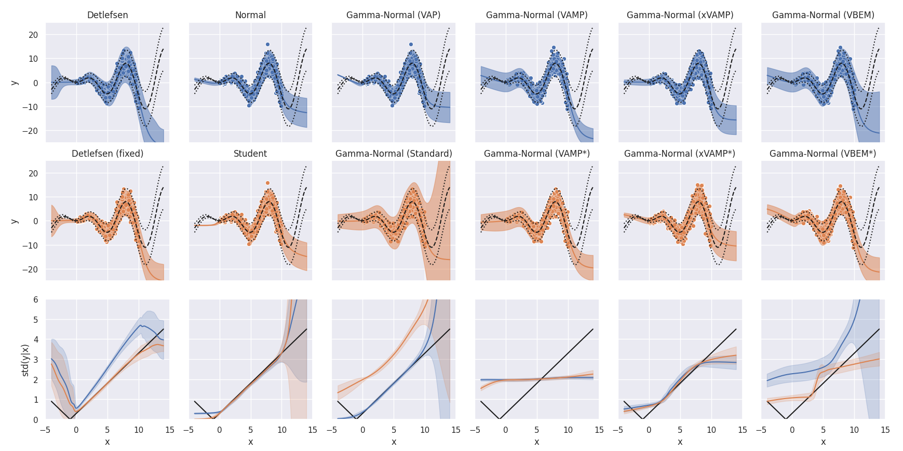

# Variational Variance

This repository is the official implementation of
[Variational Variance: Simple, Reliable, Calibrated Heteroscedastic Noise Variance Parameterization](https://arxiv.org/). 

We include some [code](https://github.com/SkafteNicki/john) files from
[Reliable training and estimation of variance networks](https://arxiv.org/abs/1906.03260)
in the `john-master` sub-directory of our repository. Their methods constitute one of our baselines.
Any file therein denoted with `_orig` is their original code. We had to modify certain files for integration.
We include these originals for easy differencing. Any file without an `_orig` pair is unmodified.

## Requirements

To install requirements:
```setup
pip install -r requirements.txt
```

Our code is based in TensorFlow 2.3, which automatically detects and utilizes any available CUDA acceleration.
However, the baseline code from Detlefsen et al., 2019 (`john-master` sub-directory) is based in pyTorch.
Their code supports enabling and disabling CUDA.
Any of our code that calls theirs does NOT access their CUDA option and consequently defaults with CUDA enabled.
Please be aware of this if running on a machine without access to CUDA acceleration.

To download UCI data sets (performed in `run_regression_uci.sh` as well):
```setup
python regression_data.py
```

Data for our VAE experiments downloads automatically via [TensorFlow Datasets](https://www.tensorflow.org/datasets).

## Reproducing Results
If you downloaded a copy of this repository with a populated `results` sub-directory, then you may already
have all of our original results. Please see the following subsections for details on how to run just the analysis.

### Toy Data
Please see `run_regression_toy.sh`, which runs our toy regression experiments in sequence.
Upon completing the experiments, this script also runs the analysis script, which generates figure 2 of our manuscript.
To run just the analysis:
```
python regression_analysis.py --experiment toy
```

### UCI Data
Please see `run_regression_uci.sh`, which runs our UCI regression experiments in parallel.
Upon completing the experiments, this script also runs the analysis script.
This script generates tables 1 and 2 of our manuscript and tables 4-9 of our supplement.
To run just the analysis:
```
python regression_analysis.py --experiment uci
```

### VAE Experiments
To run our VAE experiments, please execute both the following commands to generate the results:
```
python generative_experiments.py --dataset fashion_mnist
python generative_experiments.py --dataset mnist
```
Thereafter, you can run the analysis:
```
python generative_analysis.py
```

## Results

### Toy Data

Toy regression results. The top two rows contain individual experimental results for the
configuration in the title. Here, dashed and dotted black lines denote the true mean ± two standard
deviations. The colored dots are training points. The colored lines and their areas denote the predicted
mean ± two standard deviations. In the third row, we plot the true standard deviation (black) against
the predicted standard deviations (and its standard deviation) across 20 trials for the two experimental
configurations appearing above. The color identifies the method above by matching the colors.

### UCI Data

Table 1 (above) is from our manuscript and reports the log predictive probability of the tested methods.
Top performers are in bold. Non-validated (i.e. cited) results are in italics and may use larger neural networks.


Table 2 (above) is also from our manuscript and reports the number of times a method won or statistically tied
the winner for one of our proposed posterior predictive check (PPC) metrics.
The statistical test is a two-sided Kolmogorov–Smirnov test with a p <= 0.05 significance threshold.

### Deep Latent Variable Models (VAEs)

VAE posterior predictive checks for MNIST. The rows within a subplot from top to bottom are randomly selected
test data followed by the posterior predictive mean and variance and a sample from it.


VAE posterior predictive checks for Fashion MNIST. Same arrangement as above.

## Contributing

We have selected an MIT license for this repository.
